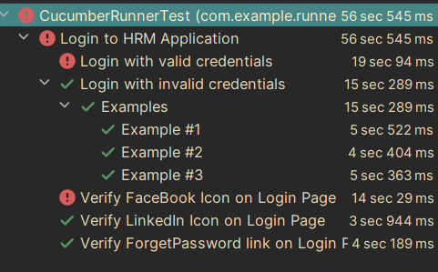

**Integration of Cucumber7 with Selenium and JUnit5**

This repository was forked from [Cucumber Selenium Junit5 exampple](https://github.com/vibssingh/Cucumber_Selenium_JUnit5.git).
I modified it so it actually runs (atleast on my machine...) Not all of the tests are green, but some of them are... ^_^ I did not want to 
fix the tests, my goal was to fix the ability of tests to actually run. For me tests results look like this:


This is a sample application to demonstrate how to setup and run Cucumber tests with JUnit5.

1. **This framework consists of:**<br>

````
   Cucumber – 7.6.0 
   Java 17
   JUnit Jupiter – 5.9.0
   Maven – 3.9.9
   Selenium – 4.3.0
````

**2. To run the tests through command line, use the command**

````  
 mvn clean verify
````   